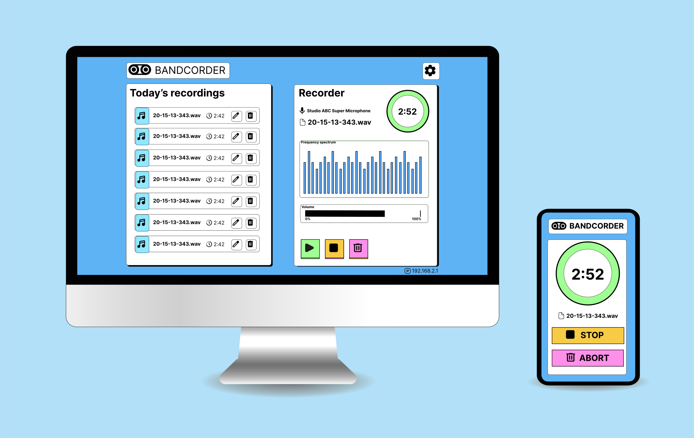

# Bandcorder

Create audio recordings in multi-user sessions by a single button tap.

Disclaimer: This is early stage software

## About

Simply put, Bandcorder allows to create, start & stop audio recordings easily in a multi-user, shared session using a smartphone app.
The recordings may be done using a (high quality) microphone attached to a server (potentially a laptop).

## Motivation

During jam sessions or Band practice the need to do simple recordings arises frequently. Since rehearsal rooms
are usually not equipped with the gear to perform this type of recording, musicians often resort to
using their phones. This comes with the following problems:

- At best mediocore audio quality with little to no configuration options
- Having to manually share the recordings with bandmates via different channels (e.g. messengers) later on

Bandcorder solves both of these problems in a simple manner.

## How it works

You open the app and connect to the desktop application via its IP. Once the connection is established,
the client is part of a recording session.
Any client may start or stop recordings and the recording state is synced between all participants.  
The server uses the default Microphone of the system to create the recordings. The audio files are
saved in a directory corresponding to the current day with a file name resembling the current time.
To share the recordings quickly with bandmates, a Cloud storage sync (e.g. using Dropbox) may be set
for the folder.

## Getting started

Binary versions of the desktop application and the app will be provided as part of the 2.0 milestone. Currently
you have to take a look at the readmes of the [app](app/README.md) and [desktop application](server/README.md)
and build them yourself.
